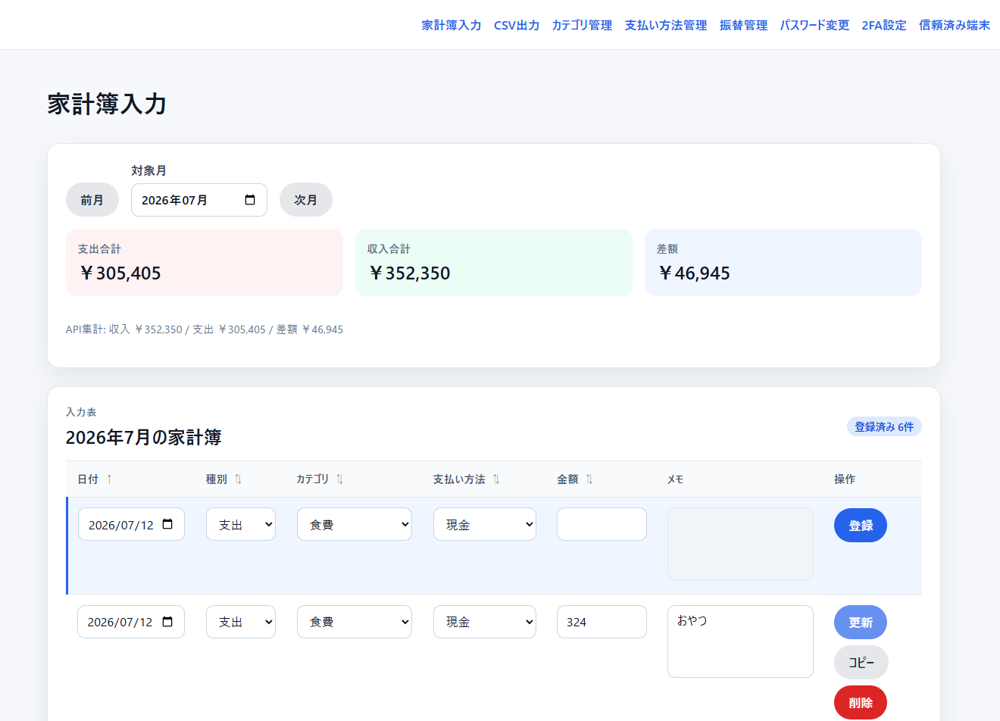

# 家計簿アプリ

Spring Boot(Kotlin)+Vueの家計簿webアプリです。



## 起動方法

### Docker Compose

`Docker`と`Docker Compose`を用意して、環境変数ファイルを作成します。

```bash
cp .env.example .env
```

`.env`の`DB_PASSWORD`、`KAKEIBO_INITIAL_USERNAME`、`KAKEIBO_INITIAL_PASSWORD`を変更します。初期パスワードは12文字以上で設定してください。

```bash
docker compose up -d --build
```

起動後、`http://localhost:8080/`を開きます。ポートを変更する場合は`.env`の`APP_PORT`を変更してください。

## 開発

JDK、Node.js、Playwrightのブラウザ、shellcheck、shfmtは開発用コンテナ(`Dockerfile.dev`)に入っています。ホストに必要なのは`Docker`と`git`だけです。

```bash
docker compose --profile dev build dev
```

整形、静的解析、バックエンドのテスト、E2Eテストをまとめて実行します。

```bash
docker compose run --rm dev ./gradlew verifyAll
```

開発サーバーは同じコンテナの中で両方を起動します。

```bash
docker compose up -d postgres
docker compose run --rm --service-ports dev bash
```

```bash
./gradlew bootRun &
npm --prefix frontend run dev -- --host 0.0.0.0
```

`http://localhost:5173/`を開きます。`backend`コンテナとはポートが衝突するため、同時には起動しないでください。

## 使用技術

- バックエンド: Kotlin 2.3、Java 21、Spring Boot 4.1、Spring Security、Spring Data JPA、Flyway
- フロントエンド: Vue 3、TypeScript、Vite、Vue Router
- データベース: PostgreSQL 18
- 開発・テスト: Gradle、Docker Compose、Playwright
